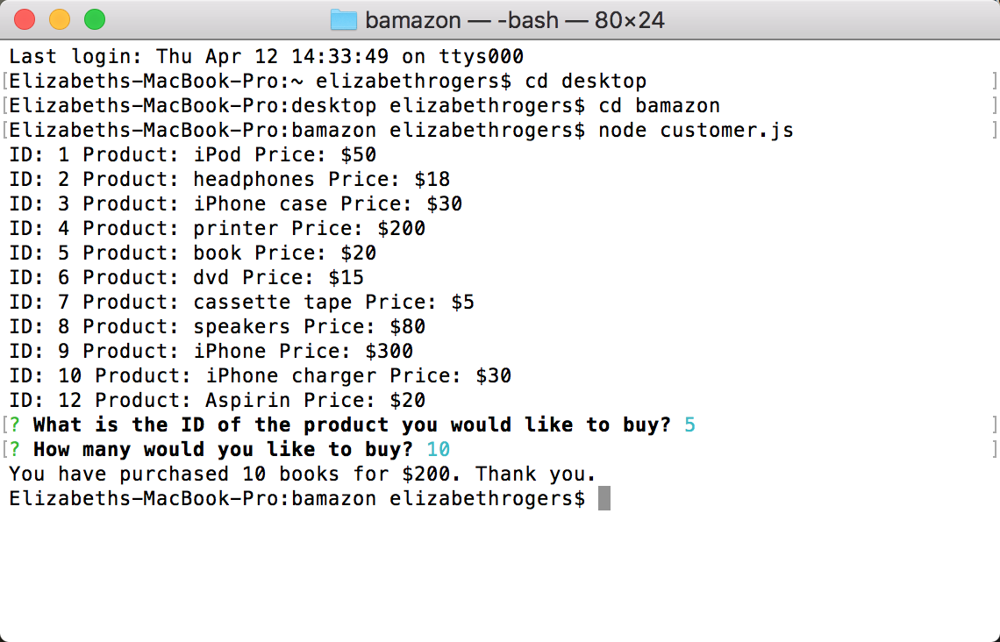

# bamazon
Deploy 'node customer.js' in the command line to:
1) See a full list of the items for sale, their prices and IDs.

2) Select an item using its ID, then select the number of these items desired for purchase.

3) If you try to buy more of an item than is in stock, you will be alerted that their is an insufficient quantity.

Deploy 'node manager.js' in the command line to:
1) See a list of products for sale

2) View "Low Inventory" items, meaning items with a total current stock of 5 or fewer.

3) Increase the inventory of a given item, selected using its ID.

4) Add a new product to the list of products, setting the name, price, and quantity in stock.

Do not deploy 'node supervisor.js'; I have not yet completed it.
